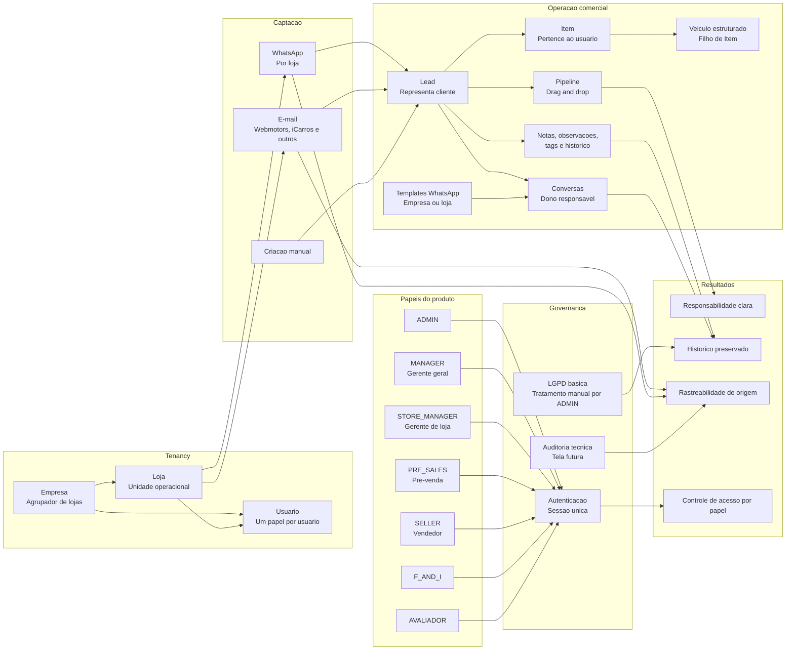
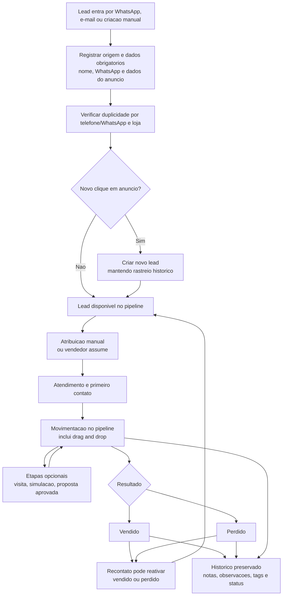
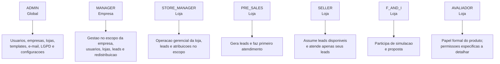
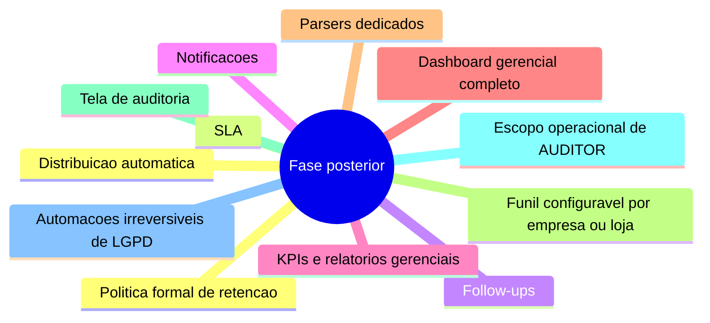

# Diagrama De Produto Consolidado

Diagrama baseado nas decisoes consolidadas do Trello em [Decisoes Consolidadas Do Trello](decisoes-consolidadas-trello.md).

Este documento nao introduz novas regras. Ele organiza visualmente o escopo definido para MVP e fase posterior.

## Visao Geral Do Produto

## Jornada Do Lead

## Escopo Por Papel

## Itens Fora Do MVP

