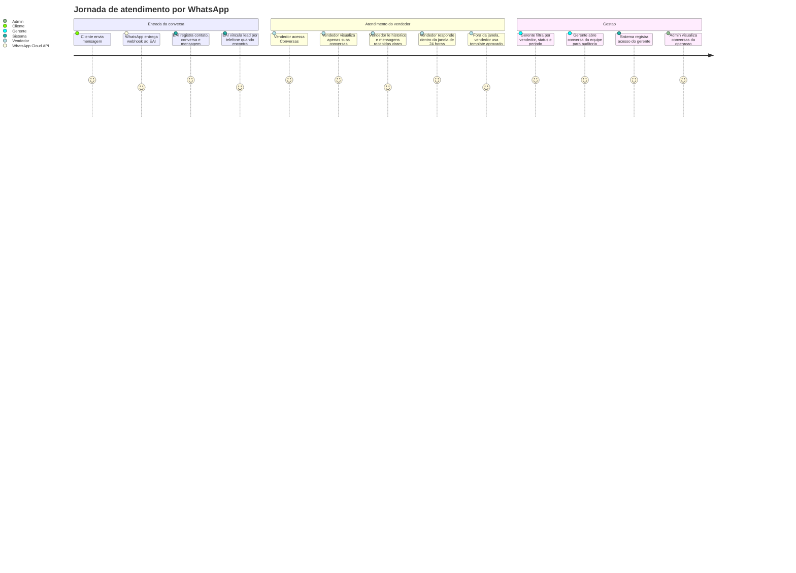
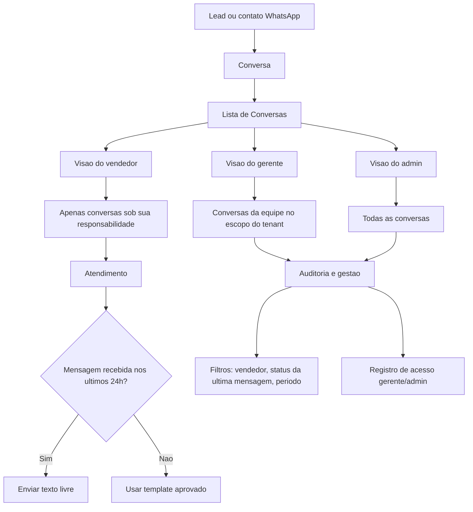
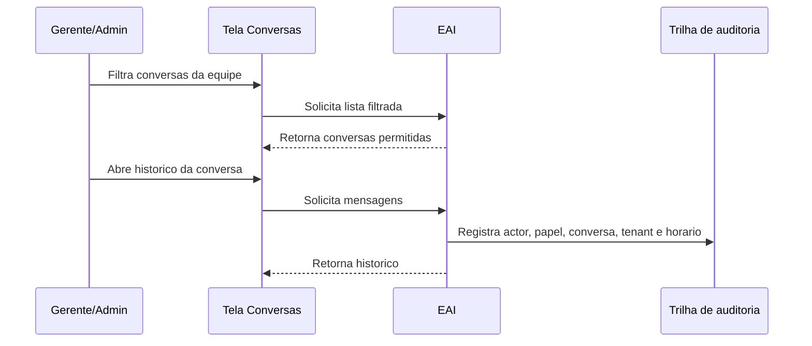

# Diagrama De Produto: WhatsApp E Conversas

Este documento descreve o fluxo de produto para atendimento por WhatsApp e gestao de conversas.

Objetivo do fluxo:

- Centralizar conversas de WhatsApp vinculadas a leads ou contatos.
- Permitir que vendedores atendam suas proprias conversas.
- Permitir que gerentes auditem conversas da equipe.
- Permitir que admins tenham visao completa.
- Registrar acessos gerenciais e administrativos para auditoria.

## Atores

- Cliente: pessoa que envia ou recebe mensagens pelo WhatsApp.
- Vendedor: usuario responsavel pelo atendimento comercial.
- Gerente: usuario que acompanha conversas da equipe para gestao.
- Admin: usuario com visao geral da operacao.
- WhatsApp Cloud API: provedor externo de mensagens.

## Jornada Do Atendimento

## Visao Do Fluxo De Produto

## Permissoes Do Fluxo

| Perfil | Pode listar conversas | Escopo | Acesso auditado |
| --- | --- | --- | --- |
| `SELLER` | Sim | Apenas conversas sob sua responsabilidade | Nao |
| `MANAGER` | Sim | Conversas da equipe no escopo de tenant | Sim |
| `ADMIN` | Sim | Todas as conversas | Sim |
| `RECEPTIONIST` | Nao definido neste fluxo | Pendente | Pendente |
| `AUDITOR` | Nao definido neste fluxo | Pendente | Pendente |

## Estados E Indicadores Visiveis

Hoje o produto exibe status tecnico de mensagem, nao status proprio de conversa.

Status de mensagem usados na tela:

- `RECEIVED`: mensagem recebida do cliente.
- `SENT`: mensagem enviada pela plataforma.
- `DELIVERED`: mensagem entregue pelo provedor.
- `READ`: mensagem lida.
- `FAILED`: falha de envio.

Indicadores de gestao:

- Total de conversas retornadas pelo filtro.
- Total de mensagens nao lidas.
- Ultima mensagem.
- Data e hora da ultima interacao.
- Responsavel pela conversa.

## Fluxo De Auditoria

## Pendencias De Produto

- Definir se conversa deve ter status proprio ou se os filtros devem continuar usando status da ultima mensagem.
- Definir o comportamento de `AUDITOR` e `RECEPTIONIST` no contexto de conversas.
- Definir se gerente sem loja vinculada pode auditar todas as lojas da empresa.
- Definir se conversas sem vendedor responsavel devem aparecer para gerente/admin.
- Definir quais eventos de auditoria precisam aparecer em tela ou relatorio.
