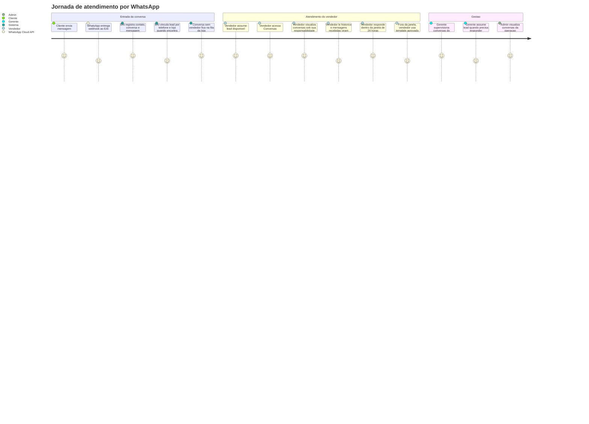
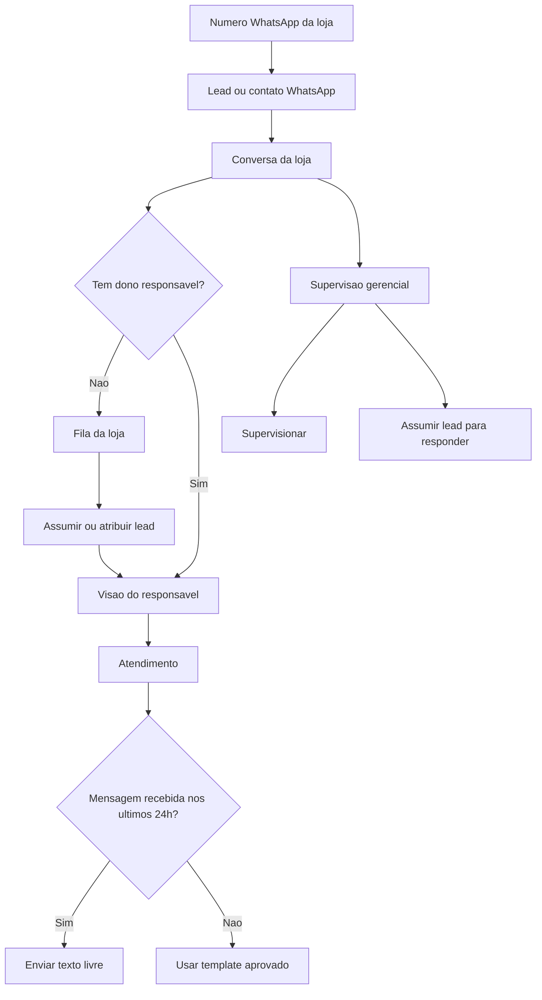

# Diagrama De Produto: WhatsApp E Conversas

Este documento descreve o fluxo de produto para atendimento por WhatsApp e gestao de conversas.

Objetivo do fluxo:

- Centralizar conversas de WhatsApp vinculadas a leads ou contatos.
- Permitir que vendedores atendam conversas sob sua responsabilidade.
- Manter conversas sem vendedor na fila da loja.
- Permitir que gerentes supervisionem conversas da equipe.
- Permitir que gerentes respondam somente quando assumirem o lead.
- Permitir que admins tenham visao global.

## Atores

- Cliente: pessoa que envia ou recebe mensagens pelo WhatsApp.
- Vendedor: usuario responsavel pelo atendimento comercial.
- Gerente geral: usuario que acompanha conversas da empresa.
- Gerente de loja: usuario que acompanha conversas da loja.
- Admin: usuario global da plataforma.
- WhatsApp Cloud API: provedor externo de mensagens.

## Jornada Do Atendimento

## Visao Do Fluxo De Produto

## Permissoes Do Fluxo

| Perfil | Pode listar conversas | Escopo | Pode responder |
| --- | --- | --- | --- |
| `ADMIN` | Sim | Global | Conforme regra operacional do atendimento |
| `MANAGER` | Sim | Todas as lojas da empresa | Apenas se assumir o lead |
| `STORE_MANAGER` | Sim | Loja em que esta alocado | Apenas se assumir o lead |
| `SELLER` | Sim | Conversas sob sua responsabilidade | Sim, quando for dono responsavel |
| `PRE_SALES` | Nao no MVP | Segunda fase para assumir fila | Nao no MVP |
| `F_AND_I` | Apenas quando relacionado ao lead | Etapas de simulacao e proposta | Conforme fluxo do lead |

## Estados E Indicadores Visiveis

O produto exibe status tecnico de mensagem, nao status proprio de conversa.

Status de mensagem usados na tela:

- `RECEIVED`: mensagem recebida do cliente.
- `SENT`: mensagem enviada pela plataforma.
- `DELIVERED`: mensagem entregue pelo provedor.
- `READ`: mensagem lida.
- `FAILED`: falha de envio.

Indicadores operacionais:

- Total de conversas retornadas pelo filtro.
- Total de mensagens nao lidas.
- Ultima mensagem.
- Data e hora da ultima interacao.
- Responsavel pela conversa.
- Fila da loja para conversas sem vendedor.

## Regras Definidas

- Cada loja deve ter apenas um numero de WhatsApp.
- Conversas pertencem a loja do numero de WhatsApp.
- Conversas sem vendedor ficam na fila da loja.
- Pre-venda assumir conversas da fila fica para segunda fase.
- Gerente apenas supervisiona enquanto o lead estiver no nome do vendedor.
- Gerente pode responder somente quando assumir o lead.
- Templates da empresa podem ser usados por todas as lojas.
- Templates da loja sao especificos daquela loja.

## Pendencias De Produto

- Definir se eventos de auditoria de conversas precisam aparecer em tela ou apenas ficar registrados tecnicamente.
- Definir tratamento de midias de WhatsApp: apenas metadados ou download e armazenamento.
