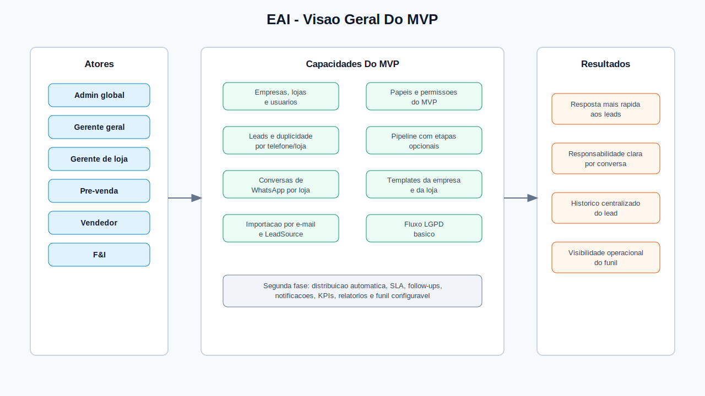
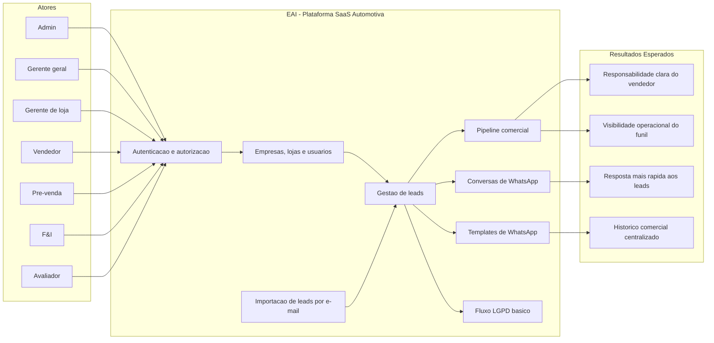
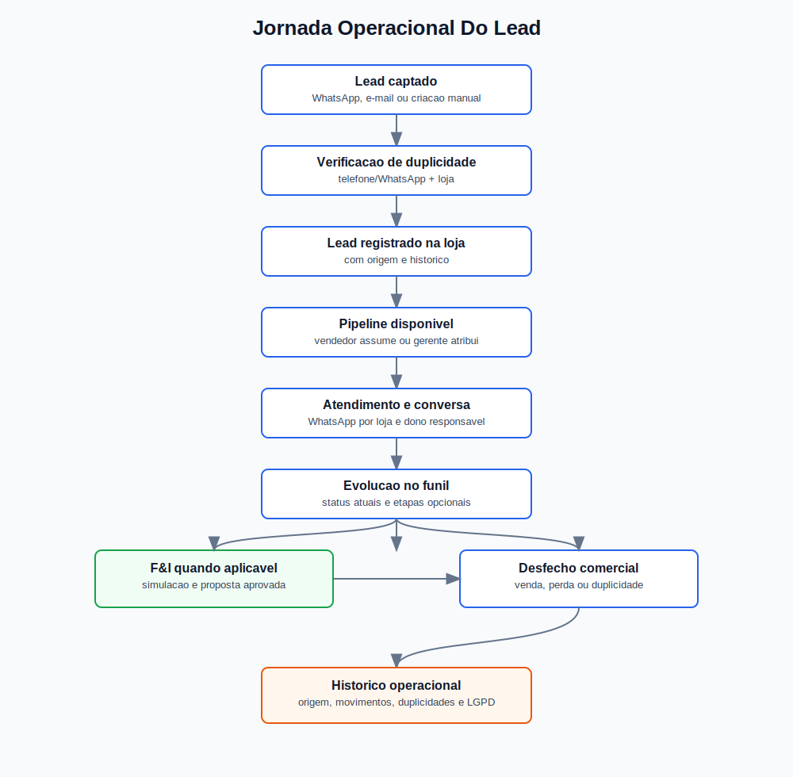
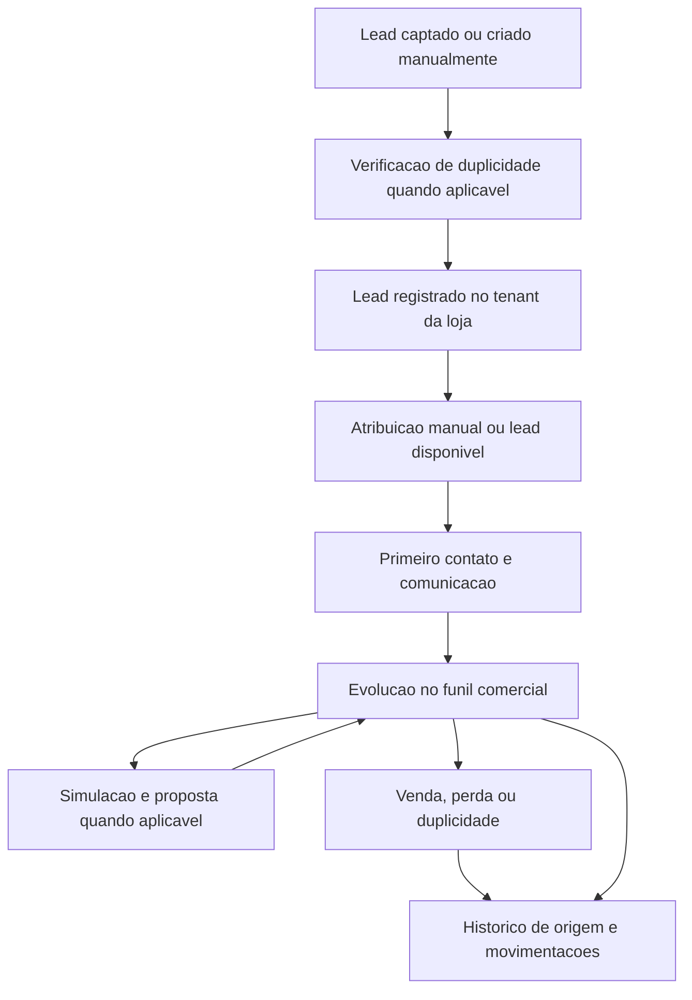

# Diagrama De Produto

Este documento resume a visao de produto do EAI a partir dos documentos de negocio atuais. Ele nao define novas regras; fluxos, permissoes e metricas ainda pendentes continuam registrados em [Pendencias de produto](pendencias.md).

## Visao Geral

## Jornada Operacional

## Capacidades Por Contexto

| Contexto | Capacidades documentadas |
| --- | --- |
| Identidade e acesso | Login, sessao unica, refresh token rotativo, logout global e controle por papeis conhecidos. |
| Tenancy | Empresa como agrupador, lojas como unidades operacionais, usuarios e escopo de visibilidade por tenant. |
| Leads | Criacao, pesquisa normalizada, atualizacao, atribuicao manual, status, notas, observacoes, tags globais, historico e duplicidade por telefone/loja. |
| Pipeline | Visualizacao de leads agrupados por status e movimentacao por arrastar e soltar. |
| Conversas de WhatsApp | Conversas por loja, fila da loja quando sem vendedor, dono responsavel e armazenamento de midias em S3/bucket. |
| Comunicacao | Templates da empresa, templates especificos da loja, placeholders automaticos e envio por WhatsApp. |
| Importacao por e-mail | Contas IMAP por loja, sincronizacao com retentativas, origem `LeadSource`, mensagens marcadas como lidas e duplicidade por telefone/loja. |
| LGPD | Fluxo administrativo basico e manual por `ADMIN`, sem automacoes irreversiveis no MVP. |
| Segunda fase | Distribuicao automatica, SLA, follow-ups, notificacoes, KPIs, relatorios gerenciais, funil configuravel, tela de auditoria e `AUDITOR` fora do MVP. |

## Limites Conhecidos

Ficam fora do escopo atual, conforme a visao de produto:

- Gestao de pagamentos, assinatura e billing.
- BI avancado ou data warehouse.
- Aplicativos mobile nativos.
- Parsers especificos por marketplace ficam fora do MVP.
- Distribuicao automatica, SLA, follow-ups, notificacoes e relatorios gerenciais ficam fora do MVP.
