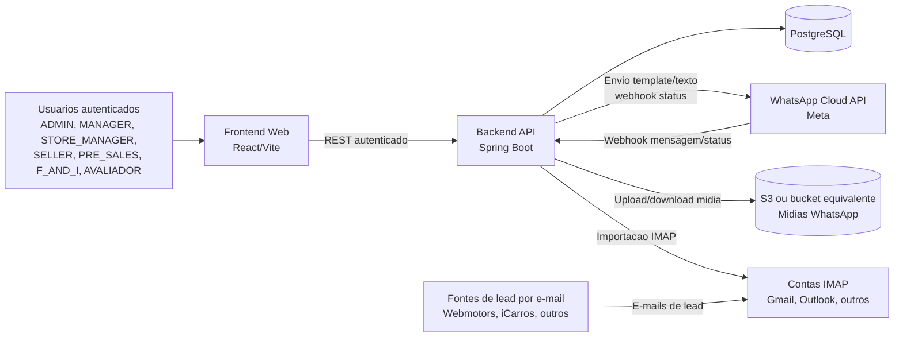
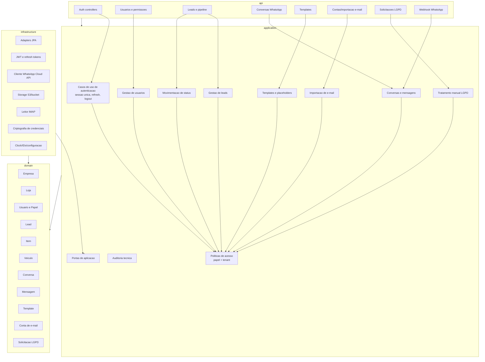
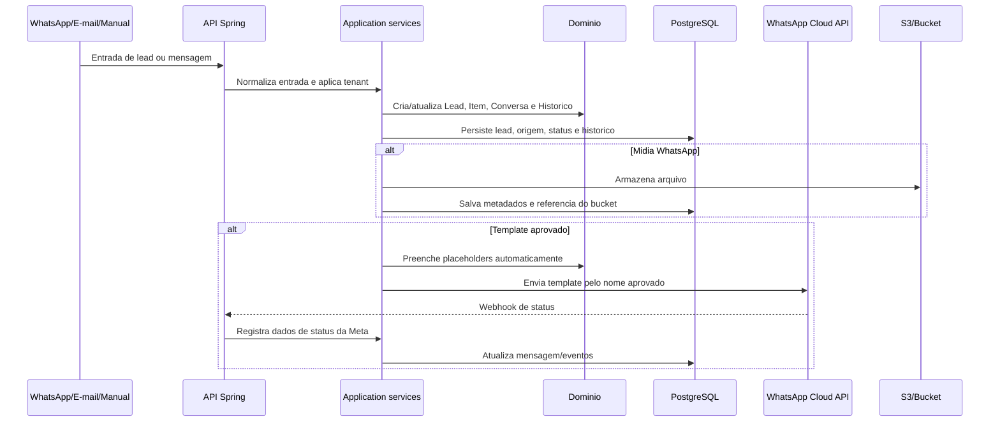
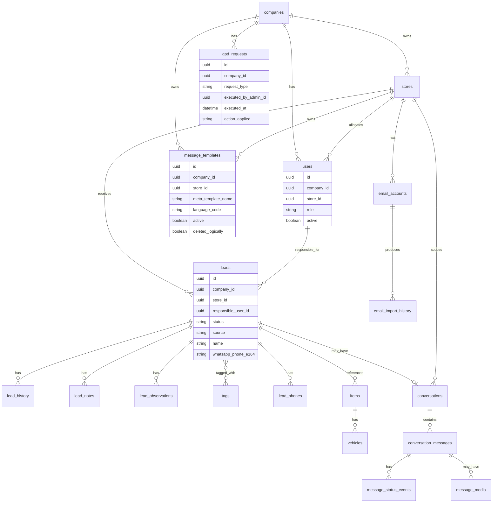
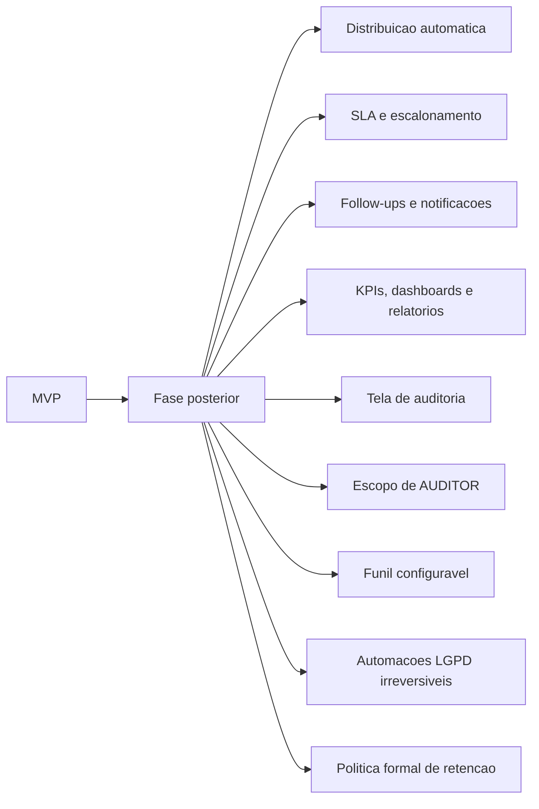

# Diagrama De Arquitetura Consolidada

Diagrama tecnico baseado nas decisoes consolidadas do Trello em `docs/negocio/decisoes-consolidadas-trello.md`.

Este documento descreve a arquitetura alvo para orientar documentacao tecnica futura. Ele nao substitui ADRs nem autoriza implementacao fora da Sprint 0.

## Visao De Contexto

## Componentes Alvo No Backend

## Fluxo De Captacao E Atendimento

## Modelo De Dados Conceitual

## Regras Arquiteturais Derivadas

- A API deve delegar regras de negocio para a camada de aplicacao.
- Politicas de papel e tenant devem ser reutilizaveis entre leads, conversas, usuarios, templates, e-mail e LGPD.
- Dominio nao deve depender de Spring, JPA, DTOs HTTP, clientes Meta, IMAP ou S3.
- Persistencia, WhatsApp Cloud API, IMAP, criptografia e bucket devem ser adapters de infraestrutura.
- Midias WhatsApp devem ser referenciadas no banco e armazenadas fora dele em S3/bucket.
- Dados de status da Meta devem ser persistidos como eventos ou dados de rastreio tecnico.
- Exclusao logica deve ser usada para templates ja utilizados.
- Dados historicos de empresas, lojas, leads e importacoes devem ser preservados quando houver desativacao ou exclusao logica.
- Automacoes irreversiveis de LGPD nao entram no MVP.

## Fronteiras De Fase Posterior

