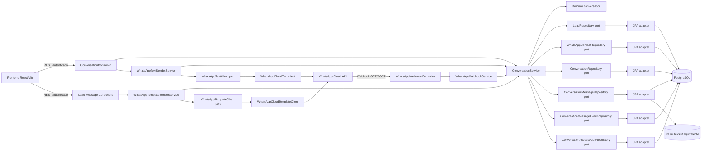
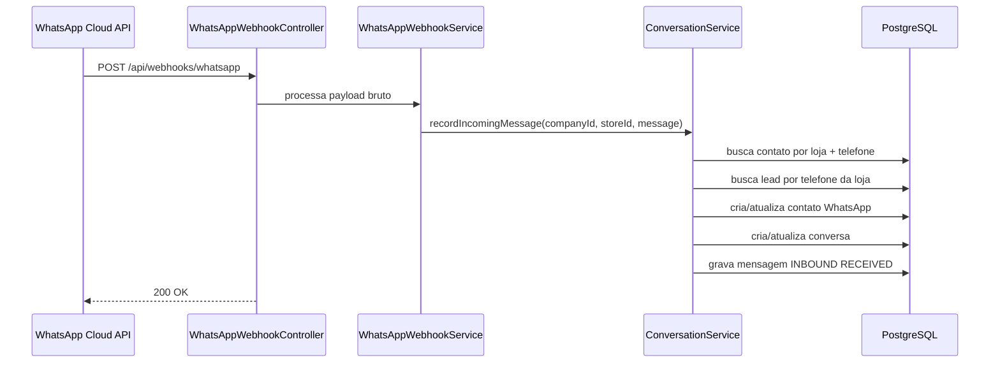
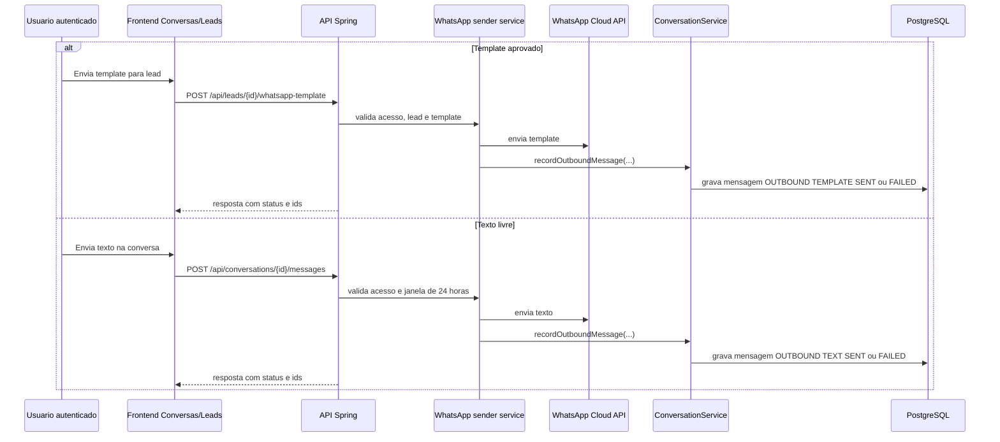
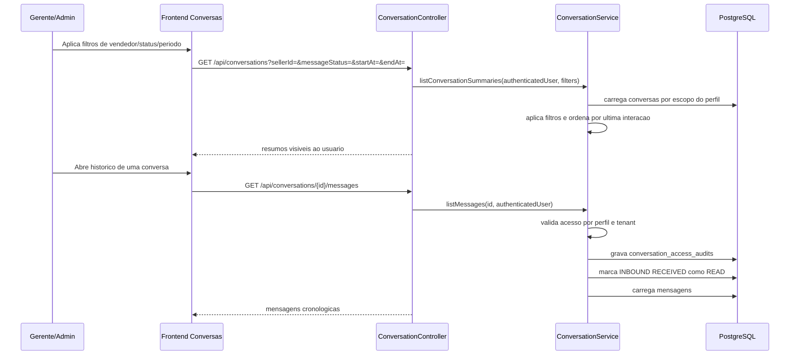
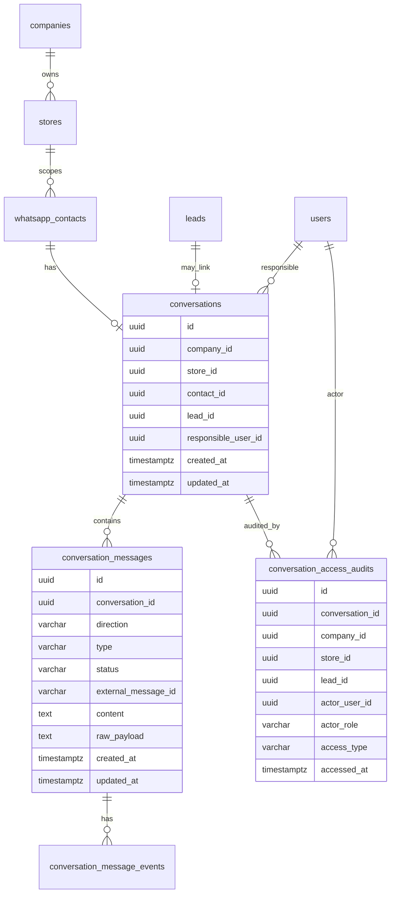

# Diagrama De Arquitetura: WhatsApp E Conversas

Este documento descreve a arquitetura implementada para o fluxo de WhatsApp, conversas, auditoria e gestao de conversas.

Escopo deste diagrama:

- Webhook publico da WhatsApp Cloud API.
- Registro de contatos, conversas, mensagens e eventos de status.
- Envio de template e texto livre.
- Listagem, filtros e auditoria de acesso a conversas.
- Separacao entre frontend, API, aplicacao, dominio e infraestrutura.

Fora de escopo deste diagrama:

- Regras oficiais de multi-conta WhatsApp por empresa/loja ainda pendentes.
- Ciclo de vida proprio de status de conversa, ainda pendente de decisao de produto.
- Tela de auditoria e escopo operacional de `AUDITOR`, que ficam para fase posterior.

## Visao De Componentes

## Fluxo De Mensagem Recebida

## Fluxo De Envio

## Fluxo De Gestao E Auditoria

## Regras Tecnicas Relevantes

- `SELLER` lista apenas conversas em que `responsibleUserId` e o proprio usuario.
- `MANAGER` lista conversas do escopo de tenant atual.
- `ADMIN` lista todas as conversas.
- A API recebe filtros `sellerId`, `messageStatus`, `startAt` e `endAt`.
- `messageStatus` filtra o status da ultima mensagem, pois o dominio ainda nao possui status proprio de conversa.
- Abertura de detalhe ou mensagens por `ADMIN` e `MANAGER` gera registro em `conversation_access_audits`.
- A leitura de mensagens marca mensagens recebidas com status `RECEIVED` como `READ`.
- Dados de status recebidos da Meta devem ser preservados para rastreio tecnico.
- Midias de WhatsApp devem ser armazenadas em S3 ou bucket equivalente, com metadados e referencia persistidos no banco.
- Tela de auditoria fica para fase posterior.

## Tabelas Envolvidas

## Pendencias Relacionadas

- Definir se conversa deve ter status proprio.
- Definir mapeamento oficial multi-conta WhatsApp por empresa/loja/numero.
- Definir tratamento de mensagens recebidas sem lead vinculado.
- Definir politica de retencao e consulta dos registros de auditoria.
